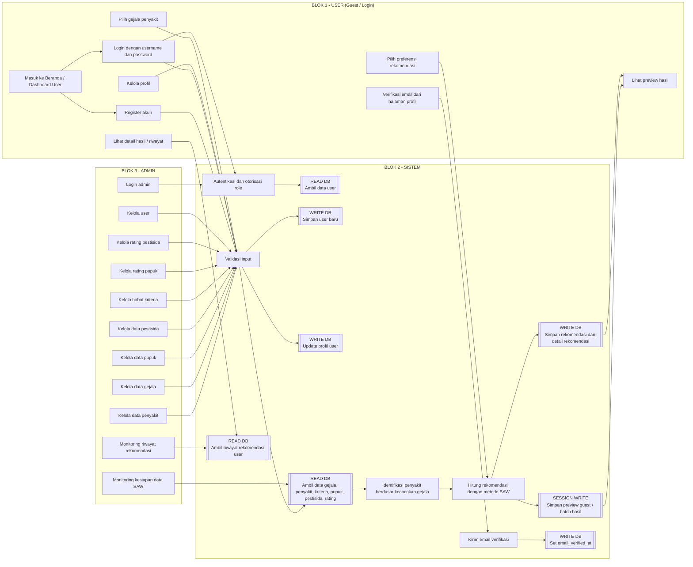
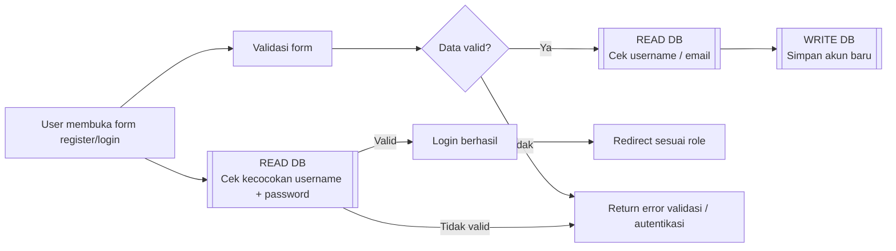
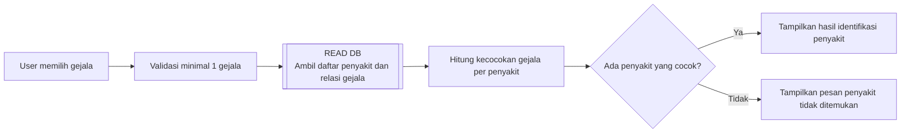
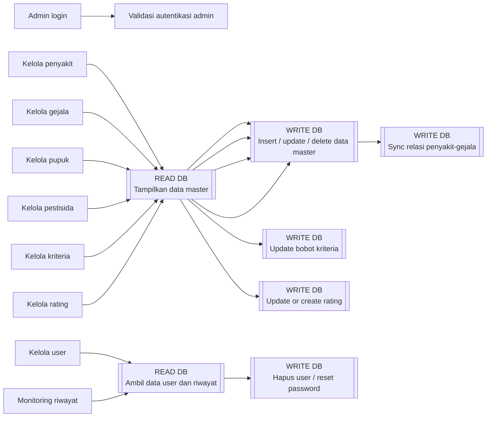

# Flowchart Profesional Sistem SPK Padi

## 1. Tujuan Dokumen

Dokumen ini menjelaskan alur kerja utama proyek **Sistem Pendukung Keputusan (SPK) Padi** dalam bentuk flowchart konseptual dan uraian proses yang profesional. Fokus dokumen dibagi menjadi **tiga blok utama yang saling berhubungan**, yaitu:

1. **User**: pengguna umum (`guest`) dan pengguna terautentikasi (`login/petani`)
2. **Sistem**: logika aplikasi Laravel, validasi, perhitungan SAW, pengelolaan session, dan penghubung ke database
3. **Admin**: pengelola data master, bobot, rating, monitoring riwayat, dan manajemen pengguna

Dokumen ini juga menandai dengan jelas:

- kapan sistem **mengambil data dari database**
- kapan sistem **menyimpan atau memperbarui data ke database**
- kapan sistem hanya menyimpan data sementara di **session**
- bagaimana hubungan proses antaraktor dari awal sampai akhir

---

## 2. Gambaran Umum Arsitektur Proses

Secara umum, sistem berjalan dengan pola berikut:

1. **User** membuka halaman publik, melakukan registrasi atau login, lalu memakai fitur diagnosis.
2. **Sistem** memvalidasi input, membaca data gejala, penyakit, kriteria, bobot, pupuk, pestisida, dan rating dari database.
3. **Sistem** menghitung hasil identifikasi penyakit dan rekomendasi menggunakan metode **SAW (Simple Additive Weighting)**.
4. Jika user sudah login, hasil rekomendasi disimpan sebagai **riwayat** ke database. Jika user masih guest, hasil hanya disimpan sementara di **session** untuk preview.
5. **Admin** menyiapkan seluruh data master dan parameter SAW agar proses rekomendasi dapat berjalan benar.

Dengan demikian, hubungan antarblok adalah:

- **User** menghasilkan input proses bisnis
- **Sistem** memproses input dan mengelola aturan
- **Admin** menyiapkan data dasar dan menjaga kualitas data
- **Database** menjadi pusat penyimpanan seluruh data permanen

---

## 3. Flowchart Utama Tiga Blok

Flowchart di bawah ini dirancang dengan pembagian blok **User - Sistem - Admin** dan penanda baca/tulis database.

---

## 4. Penjelasan Profesional per Blok

## 4.1 Blok User

Blok user dibagi menjadi dua kondisi, yaitu **guest** dan **user login (petani)**.

### A. User sebagai Guest

User yang belum login tetap dapat:

- membuka halaman beranda
- melihat dashboard user
- membuka halaman diagnosis
- memilih gejala
- melihat hasil identifikasi penyakit
- melihat preview rekomendasi

Namun pada kondisi guest, hasil rekomendasi **tidak disimpan permanen ke database**. Sistem hanya menyimpan hasil diagnosis dalam **session** agar tetap bisa ditampilkan pada halaman preview. Ini penting karena preview guest bersifat sementara.

### B. User sebagai Pengguna Login

Setelah user berhasil login, user dapat:

- mengakses dashboard pribadi
- memperbarui profil
- melakukan verifikasi email dari halaman profil
- melakukan diagnosis penyakit
- menyimpan hasil rekomendasi ke riwayat
- membuka detail rekomendasi yang pernah dihitung
- mencetak hasil rekomendasi

Pada kondisi login, hasil rekomendasi yang dihasilkan dari proses SAW akan **disimpan permanen ke database** pada tabel rekomendasi dan tabel detail rekomendasi.

---

## 4.2 Blok Sistem

Blok sistem merupakan inti proses aplikasi. Sistem bertugas sebagai pengendali utama semua permintaan dari user maupun admin.

Fungsi utama blok sistem meliputi:

- memvalidasi input
- melakukan autentikasi dan pembatasan hak akses
- mengambil data master dari database
- melakukan identifikasi penyakit
- melakukan perhitungan rekomendasi dengan metode SAW
- menyimpan hasil ke database atau session
- mengirim verifikasi email
- menampilkan kembali data untuk dashboard, preview, detail, dan riwayat

Blok sistem adalah penghubung langsung antara antarmuka pengguna dan penyimpanan data.

---

## 4.3 Blok Admin

Blok admin bertugas menyiapkan dan menjaga seluruh data dasar agar sistem rekomendasi dapat berjalan akurat.

Admin dapat:

- menambah, mengubah, dan menghapus penyakit
- menambah, mengubah, dan menghapus gejala
- menambah, mengubah, dan menghapus pupuk
- menambah, mengubah, dan menghapus pestisida
- mengatur bobot kriteria SAW
- mengisi rating pupuk per penyakit dan kriteria
- mengisi rating pestisida per penyakit dan kriteria
- memantau akun pengguna
- mereset password pengguna
- melihat seluruh riwayat rekomendasi
- memantau kesiapan data SAW dari dashboard admin

Artinya, blok admin berperan sebagai **penyedia data dan pengendali kualitas data**, sedangkan blok user berperan sebagai **pengguna hasil keputusan**.

---

## 5. Flowchart Detail Proses Registrasi dan Login

### Penjelasan

Pada saat registrasi, sistem:

1. menerima input `username`, `email`, dan `password`
2. memvalidasi format dan keunikan data
3. **mengambil data dari database** untuk memastikan `username` dan `email` belum dipakai
4. jika valid, sistem **menyimpan user baru ke database**
5. sistem login otomatis dan mengarahkan user ke halaman profil

Pada saat login, sistem:

1. menerima input `username` dan `password`
2. memvalidasi form
3. **mengambil data user dari database**
4. memeriksa kecocokan password terenkripsi
5. jika cocok, membuat session login dan mengarahkan user ke dashboard sesuai role

---

## 6. Flowchart Detail Proses Verifikasi Email di Profil

```mermaid
flowchart LR
    U1[User login membuka halaman profil]
    U2[Klik tombol kirim email verifikasi]
    S1[Validasi ketersediaan email]
    S2[Generate dan kirim link verifikasi]
    U3[User klik link verifikasi]
    S3[Validasi signature dan user]
    S4[[WRITE DB<br/>Update email_verified_at]]
    U4[User diarahkan kembali ke profil]

    U1 --> U2 --> S1 --> S2 --> U3 --> S3 --> S4 --> U4
```

### Penjelasan

Verifikasi email tidak dilakukan saat registrasi, tetapi dipindahkan ke halaman **Dashboard > Profile**. Alur ini lebih ramah pengguna karena registrasi tetap sederhana, sementara verifikasi dilakukan setelah akun berhasil dibuat.

Pada proses ini:

- sistem **tidak membuat user baru**
- sistem mengirim notifikasi email verifikasi
- saat link dibuka dan valid, sistem **menulis ke database** dengan mengisi kolom `email_verified_at`

---

## 7. Flowchart Detail Proses Diagnosis dan Identifikasi Penyakit

### Penjelasan

Pada tahap ini, sistem:

1. menerima daftar gejala dari user
2. memvalidasi bahwa minimal satu gejala dipilih
3. **mengambil data penyakit beserta relasi gejalanya dari database**
4. membandingkan gejala input dengan gejala milik masing-masing penyakit
5. menghitung jumlah kecocokan dan persentase kecocokan
6. menampilkan daftar penyakit yang paling relevan

Tahap ini **belum menyimpan hasil rekomendasi ke database**. Sistem masih berada pada fase identifikasi awal.

---

## 8. Flowchart Detail Proses Perhitungan Rekomendasi SAW

```mermaid
flowchart LR
    U1[User memilih penyakit hasil identifikasi]
    U2[User memilih preferensi rekomendasi]
    S1[Validasi penyakit, gejala, dan preferensi]
    S2[[READ DB<br/>Ambil kriteria]]
    S3[[READ DB<br/>Ambil alternatif pupuk dan pestisida]]
    S4[[READ DB<br/>Ambil rating pupuk dan pestisida]]
    S5[Bangun bobot final berdasarkan preferensi]
    S6[Normalisasi matriks keputusan]
    S7[Hitung nilai preferensi Vi]
    S8[Urutkan peringkat rekomendasi]
    S9{User sudah login?}
    S10[[SESSION WRITE<br/>Simpan preview hasil]]
    S11[[WRITE DB<br/>Simpan rekomendasi]]
    S12[[WRITE DB<br/>Simpan detail rekomendasi pupuk]]
    S13[[WRITE DB<br/>Simpan detail rekomendasi pestisida]]
    U3[Tampilkan preview batch hasil]

    U1 --> U2 --> S1 --> S2 --> S3 --> S4 --> S5 --> S6 --> S7 --> S8 --> S9
    S9 -->|Guest| S10 --> U3
    S9 -->|Login| S11 --> S12 --> S13 --> S10 --> U3
```

### Penjelasan

Ini adalah proses inti sistem pendukung keputusan.

#### Tahap pengambilan data dari database

Sebelum menghitung rekomendasi, sistem mengambil:

- data **kriteria**
- data **alternatif pupuk**
- data **alternatif pestisida**
- data **rating pupuk**
- data **rating pestisida**

Semua data tersebut dibutuhkan agar metode SAW dapat membentuk matriks keputusan dan melakukan normalisasi.

#### Tahap pengolahan oleh sistem

Sistem kemudian:

1. membentuk bobot final dari bobot awal kriteria dan preferensi user
2. membangun matriks nilai alternatif
3. melakukan normalisasi berdasarkan jenis kriteria `benefit` atau `cost`
4. menghitung nilai akhir `Vi = Σ(wj * rij)`
5. mengurutkan alternatif dari nilai tertinggi ke terendah

#### Tahap penyimpanan hasil

- Jika user **guest**, hasil hanya disimpan ke **session** untuk preview.
- Jika user **login**, sistem **menyimpan ke database**:
  - satu data ke tabel `rekomendasi`
  - banyak data ke tabel `detail_rekomendasi_pupuk`
  - banyak data ke tabel `detail_rekomendasi_pestisida`

Dengan demikian, penyimpanan permanen hanya terjadi untuk user yang telah login.

---

## 9. Flowchart Detail Proses Riwayat dan Detail Rekomendasi

```mermaid
flowchart LR
    U1[User login membuka menu riwayat]
    S1[[READ DB<br/>Ambil rekomendasi milik user]]
    S2[[READ DB<br/>Ambil detail pupuk dan pestisida]]
    S3[Tampilkan daftar riwayat]
    U2[User membuka detail rekomendasi]
    S4[[READ DB<br/>Ambil penyakit dan detail hasil]]
    S5[[READ DB<br/>Hitung ulang preview SAW untuk detail penjelasan]]
    S6[Tampilkan detail dan cetak]

    U1 --> S1 --> S2 --> S3 --> U2 --> S4 --> S5 --> S6
```

### Penjelasan

Saat user membuka riwayat:

- sistem **mengambil data rekomendasi** berdasarkan `id_user`
- sistem juga **mengambil relasi penyakit, detail pupuk, dan detail pestisida**
- hasil kemudian ditampilkan dalam bentuk daftar riwayat

Saat user membuka detail:

- sistem kembali **mengambil data rekomendasi tersimpan**
- sistem melakukan **read tambahan** untuk membangun tampilan detail perhitungan SAW
- sistem tidak menulis data baru pada tahap ini

---

## 10. Flowchart Detail Proses Admin

### Penjelasan

Peran admin sangat menentukan kualitas rekomendasi karena seluruh data dasar SAW dikelola dari panel admin.

#### A. Pengelolaan penyakit

Admin dapat:

- membaca daftar penyakit dari database
- menambah penyakit baru
- mengubah data penyakit
- menghapus penyakit
- menghubungkan penyakit dengan gejala terkait

Pada modul ini, sistem melakukan:

- **READ DB** saat menampilkan daftar penyakit dan daftar gejala
- **WRITE DB** saat menyimpan atau memperbarui penyakit
- **WRITE DB** saat melakukan `sync` relasi penyakit-gejala

#### B. Pengelolaan gejala, pupuk, dan pestisida

Admin dapat menambah, mengubah, dan menghapus data master.

Pada modul ini, sistem melakukan:

- **READ DB** untuk menampilkan daftar data master
- **WRITE DB** untuk insert, update, dan delete

#### C. Pengelolaan kriteria

Admin mengubah bobot dan informasi kriteria yang dipakai SAW.

Pada modul ini, sistem melakukan:

- **READ DB** saat menampilkan daftar kriteria
- **WRITE DB** saat menyimpan perubahan bobot

#### D. Pengelolaan rating

Admin mengisi rating:

- pupuk terhadap penyakit dan kriteria
- pestisida terhadap penyakit dan kriteria

Pada modul ini, sistem melakukan:

- **READ DB** untuk menampilkan penyakit, alternatif, kriteria, dan rating yang sudah ada
- **WRITE DB** menggunakan `updateOrCreate` untuk setiap kombinasi data

#### E. Pengelolaan user

Admin dapat:

- melihat daftar user petani
- menghapus akun user
- mereset password user

Pada modul ini, sistem melakukan:

- **READ DB** untuk menampilkan user dan jumlah rekomendasinya
- **WRITE DB** saat menghapus user atau memperbarui password

#### F. Monitoring riwayat dan dashboard admin

Dashboard admin berfungsi sebagai pusat monitoring:

- total penyakit, gejala, pupuk, pestisida, kriteria, user, admin, rekomendasi
- kelengkapan relasi penyakit-gejala
- total bobot kriteria
- kelengkapan rating pupuk dan pestisida
- riwayat rekomendasi terbaru
- pengguna terbaru
- penyakit paling sering direkomendasikan

Pada modul ini, sistem didominasi oleh proses **READ DB** untuk kebutuhan analitik dan monitoring.

---

## 11. Peta Aktivitas Database

## 11.1 Aktivitas Read dari Database

Sistem melakukan pengambilan data dari database pada kondisi berikut:

| Proses | Data yang Diambil |
|---|---|
| Registrasi | cek `users` untuk keunikan username dan email |
| Login | data `users` untuk autentikasi |
| Dashboard user | riwayat dan ringkasan rekomendasi |
| Diagnosis | `gejala`, `penyakit`, relasi penyakit-gejala |
| Perhitungan SAW | `kriteria`, `pupuk`, `pestisida`, `rating_pupuk`, `rating_pestisida` |
| Preview hasil | `penyakit`, `gejala`, detail alternatif |
| Riwayat user | `rekomendasi`, `detail_rekomendasi_pupuk`, `detail_rekomendasi_pestisida` |
| Profil | data `users` yang sedang login |
| Dashboard admin | statistik seluruh tabel utama |
| CRUD admin | tabel master sesuai modul |
| Monitoring riwayat admin | `rekomendasi`, `users`, `penyakit`, detail hasil |

## 11.2 Aktivitas Write ke Database

Sistem melakukan penyimpanan atau perubahan data ke database pada kondisi berikut:

| Proses | Data yang Ditulis |
|---|---|
| Registrasi | insert ke `users` |
| Update profil | update `users` |
| Verifikasi email | update `users.email_verified_at` |
| Simpan rekomendasi login | insert ke `rekomendasi` |
| Simpan detail pupuk | insert ke `detail_rekomendasi_pupuk` |
| Simpan detail pestisida | insert ke `detail_rekomendasi_pestisida` |
| CRUD penyakit | insert/update/delete `penyakit` |
| Relasi penyakit-gejala | sinkronisasi tabel relasi |
| CRUD gejala | insert/update/delete `gejala` |
| CRUD pupuk | insert/update/delete `pupuk` |
| CRUD pestisida | insert/update/delete `pestisida` |
| Update kriteria | update `kriteria` |
| Simpan rating pupuk | insert/update `rating_pupuk` |
| Simpan rating pestisida | insert/update `rating_pestisida` |
| Reset password user | update `users.password` |
| Hapus user | delete `users` |

## 11.3 Aktivitas Session

Selain database, sistem juga memakai **session** untuk data sementara.

| Proses | Data Session |
|---|---|
| Login | session autentikasi |
| Logout | invalidasi session |
| Preview rekomendasi guest | `guest_rekomendasi` |
| Preview batch hasil login | `guest_rekomendasi` sebagai pembawa hasil sebelum halaman preview ditampilkan |

---

## 12. Narasi Alur End-to-End yang Siap Dipakai di Word

Berikut narasi formal yang dapat langsung dipindahkan ke dokumen Word laporan atau skripsi:

**Sistem Pendukung Keputusan Padi** terdiri atas tiga komponen utama yang saling berinteraksi, yaitu pengguna, sistem, dan admin. Pengguna dapat berperan sebagai tamu (`guest`) maupun pengguna terdaftar yang telah login. Pada sisi lain, admin bertugas mengelola seluruh data master dan parameter perhitungan agar sistem rekomendasi dapat berjalan secara akurat dan konsisten. Sistem bertindak sebagai pusat pengendali proses, mulai dari validasi input, pengambilan data dari database, pengolahan logika identifikasi penyakit, perhitungan rekomendasi berbasis metode SAW, hingga penyimpanan hasil ke database.

Alur dimulai ketika pengguna membuka halaman utama aplikasi. Pengguna dapat melakukan registrasi dengan memasukkan username, email, dan password. Pada tahap ini, sistem memvalidasi seluruh input dan memeriksa keunikan username serta email terhadap database. Jika seluruh data valid, sistem menyimpan akun baru ke tabel pengguna dan mengarahkan pengguna ke halaman profil. Setelah berhasil login, pengguna dapat memperbarui data profil, termasuk melakukan verifikasi email melalui menu profil. Ketika pengguna menekan tombol verifikasi email, sistem mengirimkan tautan verifikasi dan akan memperbarui status verifikasi email pada database setelah tautan tersebut dibuka dengan valid.

Pada proses utama diagnosis, pengguna memilih satu atau lebih gejala yang dialami tanaman padi. Sistem kemudian mengambil data penyakit beserta relasi gejalanya dari database, lalu menghitung tingkat kecocokan antara gejala yang dipilih pengguna dan gejala yang dimiliki masing-masing penyakit. Hasil identifikasi ini digunakan untuk menghasilkan daftar penyakit yang paling relevan. Setelah itu, pengguna memilih penyakit yang ingin diproses lebih lanjut beserta preferensi rekomendasi yang diinginkan. Sistem selanjutnya mengambil data kriteria, alternatif pupuk, alternatif pestisida, serta seluruh data rating yang diperlukan dari database. Berdasarkan data tersebut, sistem membentuk matriks keputusan, melakukan normalisasi sesuai jenis atribut benefit atau cost, lalu menghitung nilai preferensi untuk setiap alternatif menggunakan metode Simple Additive Weighting.

Jika proses dilakukan oleh pengguna yang belum login, hasil rekomendasi hanya disimpan sementara dalam session dan ditampilkan pada halaman preview. Sebaliknya, jika proses dilakukan oleh pengguna yang telah login, sistem menyimpan hasil rekomendasi ke database pada tabel rekomendasi beserta detail rekomendasi pupuk dan pestisida. Hasil yang telah tersimpan ini kemudian dapat diakses kembali melalui menu riwayat, dilihat rinciannya, dan dicetak sebagai laporan hasil rekomendasi.

Di sisi admin, seluruh kualitas proses pengambilan keputusan sangat bergantung pada kelengkapan data yang dikelola. Admin bertanggung jawab untuk menambah, memperbarui, dan menghapus data penyakit, gejala, pupuk, pestisida, kriteria, serta rating pupuk dan pestisida. Admin juga dapat memantau data pengguna, mereset password, serta meninjau riwayat rekomendasi yang telah dihasilkan pengguna. Dashboard admin menyediakan ringkasan kondisi sistem, termasuk statistik jumlah data master, tingkat kelengkapan relasi penyakit-gejala, total bobot kriteria, dan kesiapan data rating yang menjadi prasyarat perhitungan SAW.

Dengan struktur ini, hubungan antaraktor menjadi jelas. Pengguna berperan sebagai pemberi input gejala dan penerima hasil rekomendasi, sistem berperan sebagai pemroses dan pengambil keputusan berbasis data, sedangkan admin berperan sebagai pengelola pengetahuan dan pengendali kualitas data. Seluruh proses permanen disimpan pada database, sementara proses sementara dikelola melalui session agar alur pengguna tetap responsif dan mudah digunakan.

---

## 13. Kesimpulan Flowchart

Secara profesional, flowchart proyek ini dapat disimpulkan sebagai berikut:

1. **Blok User** menjadi sumber input utama berupa registrasi, login, pengelolaan profil, pemilihan gejala, dan penggunaan hasil rekomendasi.
2. **Blok Sistem** menjadi pusat logika yang memvalidasi data, mengambil data dari database, menjalankan metode SAW, mengelola session, dan menyimpan hasil permanen.
3. **Blok Admin** memastikan seluruh data master, bobot, rating, dan monitoring sistem selalu siap sehingga keputusan yang dihasilkan memiliki dasar data yang benar.

Dengan pembagian ini, flowchart proyek sangat cocok dipresentasikan sebagai model **tiga blok terintegrasi**: **User - Sistem - Admin**, dengan **Database** sebagai pusat penyimpanan dan sumber data utama di seluruh proses bisnis.
