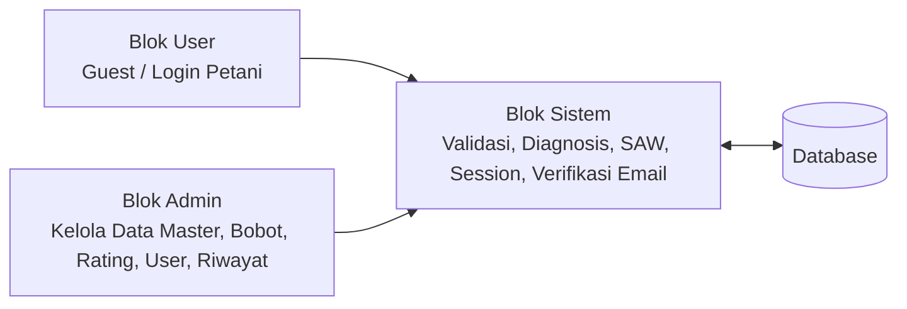
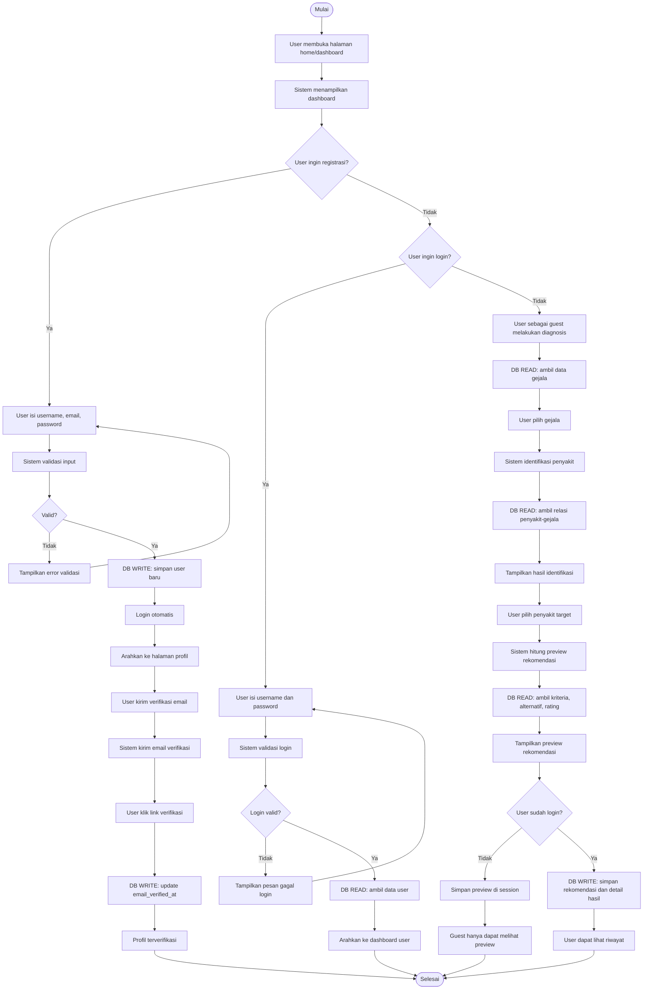
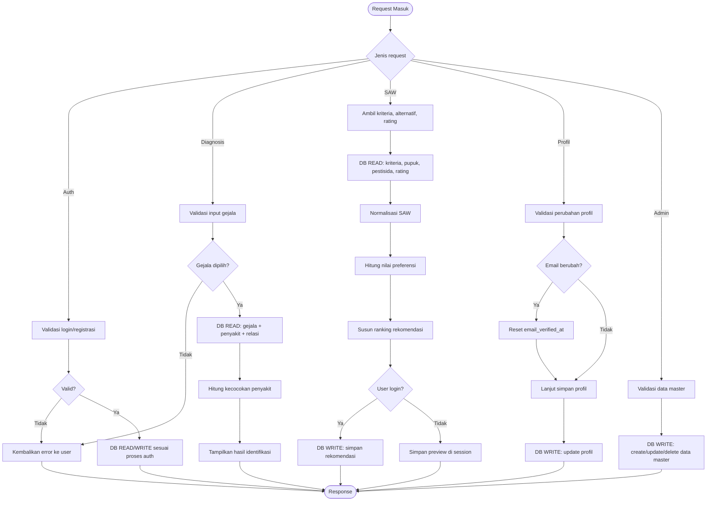
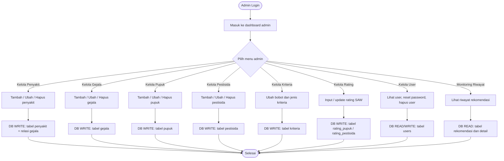

# FLOWCHART SISTEM SPK PUPUK DAN PESTISIDA PADI

## 1. Identitas Dokumen

- Nama sistem: Sistem Pendukung Keputusan (SPK) Rekomendasi Pupuk dan Pestisida Padi
- Basis metode: SAW (Simple Additive Weighting)
- Aktor utama: User `Guest`, User `Login/Petani`, Sistem, dan Admin
- Tujuan dokumen: Menjelaskan alur proses sistem secara profesional dalam tiga blok besar yang saling terhubung, sekaligus menunjukkan kapan sistem mengambil data dari database dan kapan sistem menyimpan data ke database.

---

## 2. Struktur Blok Flowchart

Flowchart sistem ini dibagi menjadi 3 blok besar:

1. Blok User
   Blok ini merepresentasikan aktivitas pengguna umum, baik yang belum login (`guest`) maupun yang sudah login sebagai petani.

2. Blok Sistem
   Blok ini merepresentasikan proses internal aplikasi Laravel, mulai dari validasi, pembacaan data, kalkulasi diagnosis, perhitungan rekomendasi SAW, manajemen session, pengiriman email verifikasi, hingga penyimpanan hasil ke database.

3. Blok Admin
   Blok ini merepresentasikan aktivitas pengelolaan data master, bobot, rating, pengguna, dan monitoring riwayat rekomendasi.

Ketiga blok tersebut saling berhubungan melalui database sebagai pusat data utama.

---

## 3. Notasi yang Digunakan dalam Flowchart

Untuk mempermudah pembuatan flowchart di Word atau aplikasi diagram lain, setiap langkah dapat memakai notasi berikut:

- `Terminator`:
  Digunakan untuk `Mulai` dan `Selesai`.

- `Process`:
  Digunakan untuk aktivitas sistem atau pengguna.

- `Decision`:
  Digunakan untuk percabangan seperti valid/tidak valid, login berhasil/gagal, data ditemukan/tidak ditemukan, dan email terverifikasi/belum terverifikasi.

- `Data / Database`:
  Digunakan untuk menunjukkan interaksi dengan database.

- `Document / Output`:
  Digunakan untuk hasil tampilan seperti dashboard, daftar penyakit, hasil diagnosis, rekomendasi, riwayat, dan halaman profil.

Untuk penandaan interaksi database, gunakan konvensi ini:

- `DB READ`:
  Sistem mengambil data dari database.

- `DB WRITE`:
  Sistem menyimpan, memperbarui, atau menghapus data pada database.

---

## 4. Flowchart Utama Sistem dalam 3 Blok

### 4.1 Ringkasan Arsitektur Alur

Makna diagram:

- User berinteraksi dengan sistem untuk login, registrasi, diagnosis, melihat rekomendasi, mengelola profil, dan melihat riwayat.
- Admin berinteraksi dengan sistem untuk memelihara data master serta memonitor hasil proses rekomendasi.
- Sistem menjadi pusat proses bisnis.
- Database menjadi pusat penyimpanan dan sumber pembacaan data.

---

## 5. Flowchart Blok User - Sistem - Admin Secara Detail

## 5.1 Blok 1: Alur User Guest dan User Login ke Sistem

### 5.1.1 Tujuan Alur

Alur ini menjelaskan bagaimana pengguna:

- membuka dashboard;
- melakukan registrasi;
- login ke sistem;
- melakukan diagnosis;
- melihat preview rekomendasi tanpa login;
- menyimpan hasil rekomendasi ketika sudah login;
- melihat riwayat rekomendasi;
- mengelola profil dan verifikasi email.

### 5.1.2 Flowchart Naratif

### 5.1.3 Penjelasan Per Langkah

1. User membuka dashboard.
   Sistem menampilkan beranda utama yang berisi ringkasan sistem, form login, akses diagnosis, dan referensi riwayat kasus.

2. Jika user belum memiliki akun, user dapat memilih registrasi.
   Sistem menampilkan form registrasi dengan field `username`, `email`, dan `password`.

3. Sistem melakukan validasi registrasi.
   Validasi mencakup:
   - username wajib diisi;
   - username harus unik;
   - email wajib diisi;
   - email harus valid;
   - email harus unik;
   - password minimal 6 karakter.

4. Jika validasi gagal, sistem tidak menyimpan data apa pun.
   Sistem mengembalikan user ke form registrasi dengan pesan error pada field terkait.

5. Jika validasi berhasil, sistem menyimpan akun baru ke database.
   `DB WRITE`:
   - tabel `users`
   - field utama: `nama`, `username`, `email`, `password`, `role`

6. Setelah registrasi, user diarahkan ke halaman profil.
   Tujuannya agar user dapat melihat status akun dan melakukan verifikasi email.

7. User menekan tombol kirim verifikasi email dari halaman profil.
   Sistem mengirim email verifikasi ke alamat email user.

8. User membuka email dan mengklik tautan verifikasi.
   Sistem memvalidasi signature link, lalu menandai email sebagai terverifikasi.
   `DB WRITE`:
   - tabel `users`
   - kolom `email_verified_at`

9. Untuk login, user memasukkan username dan password.
   Sistem memvalidasi kredensial terhadap data di tabel `users`.
   `DB READ`:
   - tabel `users`

10. Jika login gagal, sistem menampilkan pesan error.

11. Jika login berhasil, sistem membuat session autentikasi dan mengarahkan user ke dashboard sesuai rolenya.

12. User atau guest dapat membuka menu diagnosis.
   Sistem mengambil daftar gejala dari database.
   `DB READ`:
   - tabel `gejala`

13. User memilih satu atau lebih gejala.

14. Sistem melakukan identifikasi penyakit.
   Sistem membaca data penyakit beserta relasi gejala.
   `DB READ`:
   - tabel `penyakit`
   - tabel pivot `penyakit_gejala`
   - tabel `gejala`

15. Sistem menghitung tingkat kecocokan penyakit berdasarkan irisan gejala input dengan gejala pada penyakit.

16. Hasil identifikasi ditampilkan.
   User dapat memilih satu atau lebih penyakit untuk diproses lebih lanjut ke rekomendasi.

17. Sistem menghitung preview rekomendasi SAW.
   `DB READ`:
   - tabel `kriteria`
   - tabel `pupuk`
   - tabel `pestisida`
   - tabel `rating_pupuk`
   - tabel `rating_pestisida`

18. Sistem menghasilkan:
   - ranking pupuk;
   - ranking pestisida;
   - alasan rekomendasi;
   - detail teknis;
   - preview perhitungan SAW.

19. Jika user belum login, hasil hanya disimpan pada session.
   Tidak ada penyimpanan permanen ke database.

20. Jika user login sebagai petani, hasil rekomendasi disimpan ke database sebagai riwayat pribadi.
   `DB WRITE`:
   - tabel `rekomendasi`
   - tabel `detail_rekomendasi_pupuk`
   - tabel `detail_rekomendasi_pestisida`

21. User login dapat membuka riwayat rekomendasi.
   `DB READ`:
   - tabel `rekomendasi`
   - tabel `penyakit`
   - tabel `detail_rekomendasi_pupuk`
   - tabel `detail_rekomendasi_pestisida`

---

## 5.2 Blok 2: Alur Internal Sistem

### 5.2.1 Tujuan Alur

Blok ini menekankan apa yang dilakukan oleh sistem ketika menerima permintaan dari user atau admin, serta kapan sistem berinteraksi dengan database.

### 5.2.2 Flowchart Sistem Internal

### 5.2.3 Detail Aktivitas Sistem

#### A. Subproses Autentikasi

- Login:
  `DB READ` ke tabel `users` untuk memverifikasi username dan password.

- Registrasi:
  `DB WRITE` ke tabel `users` untuk membuat akun baru.

- Logout:
  Sistem menghancurkan session login. Tidak ada write ke tabel user, tetapi session aplikasi direset.

#### B. Subproses Verifikasi Email

- Sistem memeriksa apakah user memiliki email.
- Sistem mengirim email verifikasi melalui mailer Laravel.
- Saat user klik link verifikasi:
  `DB WRITE` ke tabel `users` pada kolom `email_verified_at`.

#### C. Subproses Diagnosis

- Sistem mengambil seluruh gejala.
  `DB READ`:
  - `gejala`

- Sistem mengambil seluruh penyakit beserta relasi gejalanya.
  `DB READ`:
  - `penyakit`
  - `penyakit_gejala`
  - `gejala`

- Sistem menghitung presentase kecocokan gejala.
- Sistem menyusun daftar penyakit hasil identifikasi.

#### D. Subproses Rekomendasi SAW

- Sistem mengambil kriteria.
  `DB READ`:
  - `kriteria`

- Sistem mengambil alternatif pupuk dan pestisida.
  `DB READ`:
  - `pupuk`
  - `pestisida`

- Sistem mengambil rating tiap alternatif terhadap penyakit tertentu.
  `DB READ`:
  - `rating_pupuk`
  - `rating_pestisida`

- Sistem melakukan:
  - pembentukan matriks keputusan;
  - pencarian nilai max/min;
  - normalisasi benefit/cost;
  - perkalian bobot;
  - penjumlahan nilai preferensi;
  - ranking hasil akhir.

- Jika user login:
  `DB WRITE`:
  - `rekomendasi`
  - `detail_rekomendasi_pupuk`
  - `detail_rekomendasi_pestisida`

- Jika user guest:
  Sistem hanya menyimpan hasil pada session.

#### E. Subproses Profil

- Saat profil dibuka:
  `DB READ`:
  - `users`

- Saat profil diperbarui:
  `DB WRITE`:
  - `users`

- Saat foto profil diganti:
  `DB WRITE` pada file image di direktori proyek;
  `DB WRITE` path file ke tabel `users`.

#### F. Subproses Riwayat

- Sistem menampilkan riwayat rekomendasi milik user atau seluruh user untuk admin.
  `DB READ`:
  - `rekomendasi`
  - `users`
  - `penyakit`
  - `detail_rekomendasi_pupuk`
  - `detail_rekomendasi_pestisida`

---

## 5.3 Blok 3: Alur Admin ke Sistem

### 5.3.1 Tujuan Alur

Blok ini menjelaskan bagaimana admin melakukan pemeliharaan data master dan pengawasan hasil sistem.

### 5.3.2 Flowchart Admin

### 5.3.3 Penjelasan Per Proses Admin

#### A. Dashboard Admin

Dashboard admin berfungsi sebagai ringkasan sistem.
`DB READ`:

- total pengguna petani;
- total penyakit;
- total gejala;
- total rekomendasi;
- penyakit terbanyak direkomendasikan;
- riwayat terbaru;
- pengguna terbaru.

#### B. Kelola Data Penyakit

Admin dapat:

- menambah penyakit;
- mengubah data penyakit;
- menghapus penyakit;
- menghubungkan penyakit dengan gejala.

`DB READ`:
- `penyakit`
- `gejala`

`DB WRITE`:
- `penyakit`
- `penyakit_gejala`

#### C. Kelola Data Gejala

Admin dapat menambah, mengubah, dan menghapus gejala.

`DB READ`:
- `gejala`

`DB WRITE`:
- `gejala`

#### D. Kelola Data Pupuk

Admin dapat menambah, mengubah, dan menghapus alternatif pupuk.

`DB READ`:
- `pupuk`

`DB WRITE`:
- `pupuk`

#### E. Kelola Data Pestisida

Admin dapat menambah, mengubah, dan menghapus alternatif pestisida.

`DB READ`:
- `pestisida`

`DB WRITE`:
- `pestisida`

#### F. Kelola Kriteria

Admin dapat mengubah nama kriteria, jenis `benefit/cost`, bobot, dan keterangan.

`DB READ`:
- `kriteria`

`DB WRITE`:
- `kriteria`

#### G. Kelola Rating

Admin memasukkan nilai rating kecocokan alternatif terhadap penyakit berdasarkan kriteria.

`DB READ`:
- `penyakit`
- `pupuk`
- `pestisida`
- `kriteria`

`DB WRITE`:
- `rating_pupuk`
- `rating_pestisida`

#### H. Kelola User

Admin dapat:

- melihat daftar user;
- menghapus user petani;
- mereset password user.

`DB READ`:
- `users`

`DB WRITE`:
- `users`

#### I. Monitoring Riwayat

Admin dapat melihat:

- daftar riwayat rekomendasi;
- detail hasil per rekomendasi;
- detail perhitungan SAW.

`DB READ`:
- `rekomendasi`
- `users`
- `penyakit`
- `detail_rekomendasi_pupuk`
- `detail_rekomendasi_pestisida`

---

## 6. Matriks Interaksi Database

| Proses | Aktor | DB READ | DB WRITE |
|---|---|---|---|
| Lihat dashboard publik/user | Guest/User | `rekomendasi`, `penyakit`, `users` terbatas | - |
| Registrasi | Guest | cek `users` | `users` |
| Login | User/Admin | `users` | session auth |
| Kirim verifikasi email | User/Admin | `users` | pengiriman email, update saat verifikasi |
| Verifikasi email | User/Admin | `users` | `users.email_verified_at` |
| Lihat gejala diagnosis | Guest/User | `gejala` | - |
| Identifikasi penyakit | Guest/User | `penyakit`, `penyakit_gejala`, `gejala` | session sementara |
| Hitung rekomendasi SAW | Guest/User | `kriteria`, `pupuk`, `pestisida`, `rating_pupuk`, `rating_pestisida` | session atau `rekomendasi` + detail |
| Lihat riwayat user | User | `rekomendasi`, `penyakit`, detail | - |
| Edit profil | User/Admin | `users` | `users` |
| Kelola penyakit | Admin | `penyakit`, `gejala` | `penyakit`, `penyakit_gejala` |
| Kelola gejala | Admin | `gejala` | `gejala` |
| Kelola pupuk | Admin | `pupuk` | `pupuk` |
| Kelola pestisida | Admin | `pestisida` | `pestisida` |
| Kelola kriteria | Admin | `kriteria` | `kriteria` |
| Kelola rating | Admin | `penyakit`, `pupuk`, `pestisida`, `kriteria` | `rating_pupuk`, `rating_pestisida` |
| Kelola user | Admin | `users` | `users` |
| Monitoring riwayat | Admin | `rekomendasi`, `users`, `penyakit`, detail | - |

---

## 7. Narasi Profesional untuk Dimasukkan ke Word

Berikut narasi formal yang bisa langsung dipakai pada bab analisis sistem atau perancangan sistem:

“Sistem Pendukung Keputusan rekomendasi pupuk dan pestisida padi pada penelitian ini dirancang menggunakan tiga blok interaksi utama, yaitu blok User, blok Sistem, dan blok Admin. Blok User merepresentasikan aktivitas pengguna umum, baik yang belum login maupun yang telah login sebagai petani. Blok ini mencakup proses registrasi akun, login, diagnosis penyakit berdasarkan gejala, perhitungan rekomendasi, pengelolaan profil, verifikasi email, serta peninjauan riwayat hasil rekomendasi. Blok Sistem merepresentasikan logika inti aplikasi yang bertanggung jawab terhadap validasi masukan, pembacaan data master dari basis data, identifikasi penyakit, perhitungan metode SAW, pengelolaan session, pengiriman email verifikasi, serta penyimpanan hasil rekomendasi ke basis data. Sementara itu, blok Admin merepresentasikan proses pengelolaan data master yang menjadi fondasi perhitungan sistem, meliputi data penyakit, gejala, pupuk, pestisida, kriteria, rating, data pengguna, dan monitoring riwayat rekomendasi.”

“Interaksi antara ketiga blok tersebut sangat bergantung pada basis data sebagai pusat penyimpanan dan pengambilan data. Pada proses diagnosis dan rekomendasi, sistem secara aktif mengambil data gejala, penyakit, relasi penyakit-gejala, kriteria, alternatif, dan rating dari basis data untuk membentuk matriks keputusan dan menghasilkan ranking rekomendasi terbaik. Pada sisi lain, sistem juga melakukan penyimpanan data pada saat registrasi pengguna, pembaruan profil, verifikasi email, penyimpanan hasil rekomendasi, serta pengelolaan data master oleh admin. Dengan demikian, flowchart yang dibangun tidak hanya menggambarkan urutan aktivitas antaraktor, tetapi juga menunjukkan secara eksplisit titik-titik kapan sistem melakukan operasi `read` dan `write` terhadap basis data.”

---

## 8. Rekomendasi Tata Letak di Word

Agar tampilan flowchart di Word terlihat profesional, gunakan tata letak berikut:

1. Halaman 1:
   Judul dokumen dan diagram konteks 3 blok `User - Sistem - Admin - Database`.

2. Halaman 2:
   Flowchart detail blok User dan Sistem.

3. Halaman 3:
   Flowchart detail blok Admin dan Sistem.

4. Halaman 4:
   Tabel matriks interaksi database.

5. Halaman 5:
   Narasi analisis flowchart untuk dimasukkan ke bab laporan/skripsi.

Format visual yang disarankan:

- Gunakan `swimlane` horizontal atau vertikal untuk memisahkan `User`, `Sistem`, dan `Admin`.
- Gunakan warna berbeda:
  - User: biru muda
  - Sistem: hijau muda
  - Admin: oranye muda
  - Database: abu-abu
- Gunakan panah tegas untuk menunjukkan aliran proses.
- Beri label `DB READ` dan `DB WRITE` pada panah yang berhubungan dengan database.

---

## 9. Kesimpulan Flowchart

Secara keseluruhan, flowchart sistem SPK ini menunjukkan bahwa:

- user berperan sebagai pemberi input diagnosis dan penerima output rekomendasi;
- sistem berperan sebagai pusat pemrosesan validasi, logika identifikasi, dan perhitungan SAW;
- admin berperan sebagai pengelola kualitas data master yang memengaruhi hasil rekomendasi;
- database berperan sebagai pusat data untuk seluruh aktivitas pembacaan dan penyimpanan.

Dengan pembagian menjadi tiga blok yang saling berhubungan, flowchart ini mampu menjelaskan proses bisnis aplikasi secara runtut, detail, dan profesional, sehingga layak digunakan untuk kebutuhan dokumentasi sistem, laporan tugas akhir, maupun presentasi akademik.
